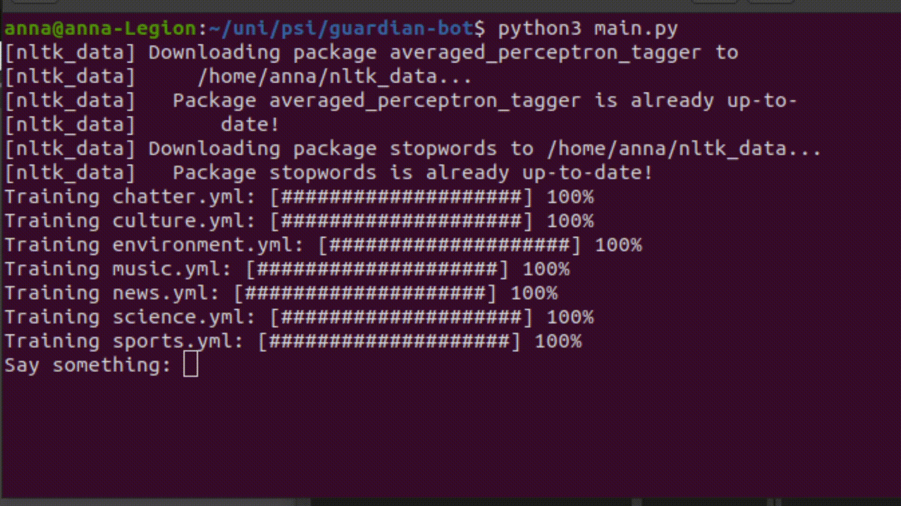
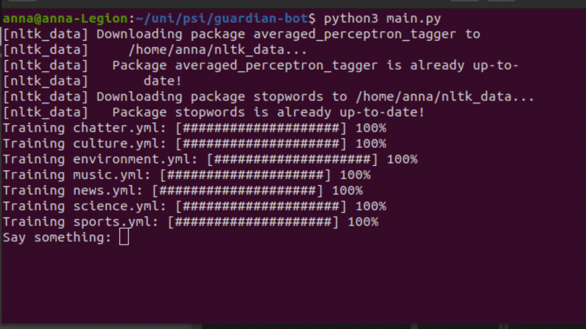

# Guardian bot
A chatterbot-based bot that uses The Guardian API to provide user with newest article from a range of categories.

## Requirements
`pip3 install chatterbot`

`pip3 install chatterbot-corpus`

## Running Guardian bot
`python3 main.py`

## Used API
Guardian API: https://github.com/prabhath6/theguardian-api-python

## Functionalities
* showing newest article in a category

* searching for an article with given search words

* news feed - providing the newest article from a category (by default every 10 seconds, easily customizable

* changing the current The Guardian edition 

## Currently supported categories
* culture
* environment
* music
* news
* science
* sports

You can type in `show me a [category] article` to get the latest news in the category.
For different intents, please refer to `[category].yml` in `data.english`.

## Used logic adapter
A custom logic adapter extending the BestMatch adapter. 
